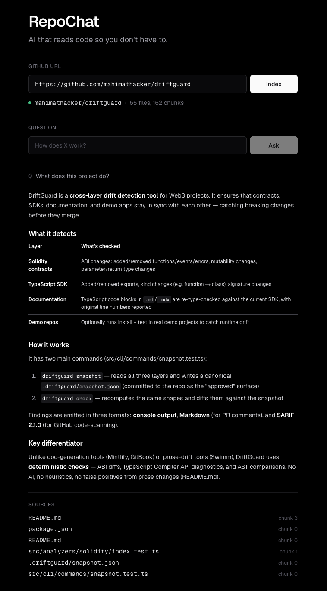

# RepoChat AI

> AI that reads any GitHub repo so you don't have to.

Paste a public GitHub repository, ask anything, get an answer with citations to the actual source files.



▶ **[Watch the 2-minute demo](https://youtu.be/kSgZSqH6iXk)**

---

## What it does

- Paste any public GitHub repository URL
- The backend fetches relevant files, chunks them, and stores embeddings in a local vector DB
- Ask natural-language questions about the repo
- Get AI-generated answers with **clickable source citations** to specific files on GitHub

## How it works

```
                   ┌────────────────────┐
                   │  GitHub repo URL   │
                   └─────────┬──────────┘
                             │
                  ┌──────────▼───────────┐
                  │  GitHub REST API     │  ← fetch tree + raw files
                  └──────────┬───────────┘
                             │
                  ┌──────────▼───────────┐
                  │  Language-aware      │  ← RecursiveCharacterTextSplitter
                  │  chunker (LangChain) │
                  └──────────┬───────────┘
                             │
                  ┌──────────▼───────────┐
                  │  OpenAI embeddings   │  ← text-embedding-3-small
                  └──────────┬───────────┘
                             │
                  ┌──────────▼───────────┐
                  │  ChromaDB (on-disk)  │  ← stores vector + path + repo_id
                  └──────────┬───────────┘
                             │
                  ─────────── ask question ───────────
                             │
                  ┌──────────▼───────────┐
                  │  Retriever - top-K   │  ← nearest-neighbor on the question
                  └──────────┬───────────┘
                             │
                  ┌──────────▼───────────┐
                  │  Claude Sonnet 4.6   │  ← grounded synthesis from chunks
                  └──────────┬───────────┘
                             │
                  ┌──────────▼───────────┐
                  │  Answer + sources    │
                  └──────────────────────┘
```

Each chunk stores its file path and repo identifier as metadata, so the retriever can scope queries to a single repo and answers can cite specific files.

## Tech stack

**Frontend**
- Next.js 16 (App Router)
- React 19
- Tailwind CSS v4 (+ typography plugin)
- react-markdown + rehype-highlight

**Backend**
- FastAPI (Python 3.11+)
- LangChain text splitters
- BGE embeddings via sentence-transformers
- ChromaDB - vector store
- Groq Python SDK - Llama 3.3 for generation
- GitHub REST API

## Running locally

### Prerequisites

- Python 3.11+
- Node.js 20+
- A [Groq API key](https://console.groq.com/keys) (for Q&A with Llama 3.3)
- (Optional) A [GitHub personal access token](https://github.com/settings/tokens) - bumps API rate limit from 60/hr to 5000/hr

### Backend

```bash
cd apps/api
python3.11 -m venv .venv
source .venv/bin/activate
pip install -r requirements.txt

cp .env.example .env
# Edit .env and add:
#   GROQ_API_KEY=gsk_...
#   GITHUB_TOKEN=ghp_...   (optional)

uvicorn main:app --reload
```

The API serves at `http://localhost:8000`. Swagger UI at `http://localhost:8000/docs`.

Embeddings are local now, using `BAAI/bge-small-en-v1.5` via `sentence-transformers`, so there is no separate embeddings API key to configure. On first run, the model may download once before indexing works.

### Frontend

```bash
cd apps/web
npm install
npm run dev
```

Open `http://localhost:3000`.

## API

### `POST /index-repo`

```json
{ "repo_url": "https://github.com/owner/repo" }
```

Fetches the repo, chunks supported files (`.md`, `.py`, `.ts`, `.tsx`, `.js`, `.jsx`, `.json`), and stores embeddings.

```json
{ "repo_id": "owner/repo", "file_count": 47, "chunk_count": 148 }
```

### `POST /ask`

```json
{ "repo_id": "owner/repo", "question": "How does authentication work?" }
```

Returns an answer + the source chunks used to generate it:

```json
{
  "answer": "Authentication uses JWT tokens issued by ... (src/auth.ts)",
  "sources": [
    { "path": "src/auth.ts", "chunk_index": 4, "distance": 0.187 },
    { "path": "src/middleware.ts", "chunk_index": 0, "distance": 0.213 }
  ]
}
```

## Folder structure

```
repochat-ai/
├── apps/
│   ├── api/                  # FastAPI backend
│   │   ├── main.py           # routes + CORS + Pydantic models
│   │   ├── repo_loader.py    # GitHub URL → file list
│   │   ├── chunker.py        # files → chunks (language-aware)
│   │   ├── embeddings.py     # chunks → vectors → Chroma
│   │   └── rag.py            # retrieve + prompt + Claude
│   └── web/                  # Next.js frontend
│       ├── app/page.tsx      # single-page chat UI
│       └── lib/api.ts        # typed API client
└── data/
    └── chroma/               # local vector DB (gitignored)
```

## The problem

Developers spend too much time understanding unfamiliar codebases.

RepoChat AI is an experiment in combining RAG, semantic search, code understanding, and AI-assisted developer workflows to make onboarding into repositories much faster.

## Future improvements

- Stream the answer (Server-Sent Events) instead of waiting for the full response
- Persist conversation history server-side
- Line-range source links (`#L42-L78`) by carrying line numbers through chunking
- Support large repos that exceed GitHub's tree-truncation limit
- Distance-threshold gating so off-topic questions get a clear "I don't know" instead of low-confidence guesses
- Per-repo collections to support clean re-indexing

## Built by

**[Mahima Thacker](https://github.com/mahimathacker)** - [@mahima_thacker](https://twitter.com/mahima_thacker) on X
